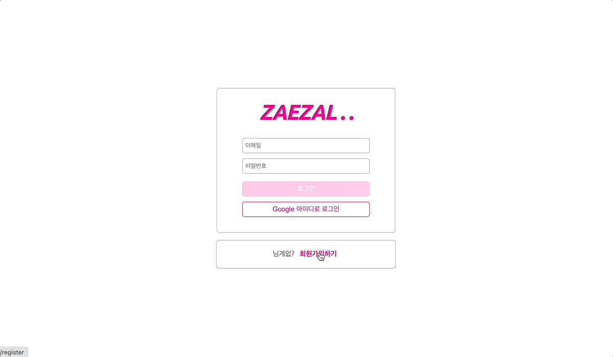
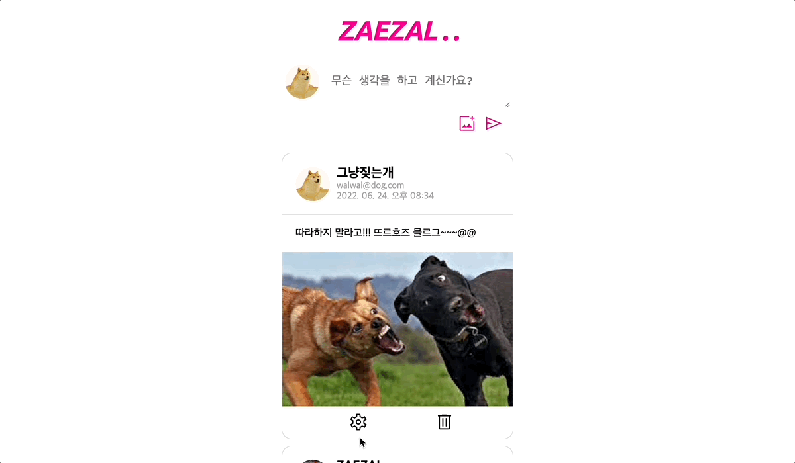

## SNS ZAEZAL
> - React & Firebase 사용해 SNS 만들기

  

## Version

## Develop

### Auth

  

  - `getAuth()`, `createUserWithEmailAndPassword()` 사용해서 회원가입하기 
  - `onAuthStateChanged()` 사용해서 계정 확인
  - `GoogleAuthProvider()`, `signInWithPopup()`으로 구글 아이디 로그인 서비스 구현

### Write ZAEZAL

  

  - `getFirestore()`, `getStorage()`로 DB 생성
  - `addDoc()`, `collection()`으로 메세지 생성
  -  `ref()`, `uploadingString()`, `getDownloadURL()`으로 이미지 파일 업로드
  - `query()`, `onSnapshot()`, `collection()` 사용해서 게시글 가져오기
  - `orderBy()`, `limit()` 사용해 정렬 방법, 개수 지정
  - `doc()`, `deleteDoc()`, `ref()`, `deleteObject()`로 게시글 삭제

  

    
  

  - `updateDoc()`으로 게시글 수정하기

  

    
  

  - `useInView()`로 인피티니 스크롤 구현

### Profile

  

  - `updateProfile()`으로 프로필 수정
  - `ref()`, `uploadString()`, `getDownloadURL()`, `deleteObject()` 사용해서 프로필 이미지 수정
  - `signOut()`으로 로그아웃